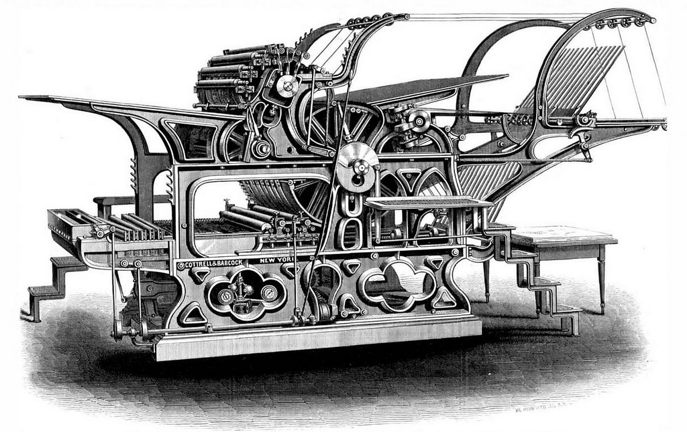

# Printing Press

**Repository for collaborative documents**

## About

This is a repository for collaborative document editing via Github. Many of my co-authors enjoy writing in LaTeX or other formats, and do so on their localhosts using their own build systems. Although tools like [Overleaf](http://www.overleaf.com) and [ShareLaTeX](http://sharelatex.com) exist (and indeed may be used with many of these documents), it's occassionally just easier to push and pull to a Github Repository.

### Attribution & Copyright

Unless specified otherwise, all work in this repository is Copyright (C) Benjamin Bengfort, All Rights Reserved. For documents with multiple authors, the work is the shared copyright of all contributors. Note that most of the work in this repository is for academic purposes - please do not include any or all of this work without proper citation or use. For more information see LICENSE.txt.

The cover photo for the repository, [Cottrell and Babcock's perfecting press for woodcut printing, 1875](https://flic.kr/p/czrcJS) was uploaded to Flickr by [Marcel Douwe Dekker](https://www.flickr.com/photos/marceldouwedekker/) and is licensed under [CC BY-NC-SA 2.0](https://creativecommons.org/licenses/by-nc-sa/2.0/)
